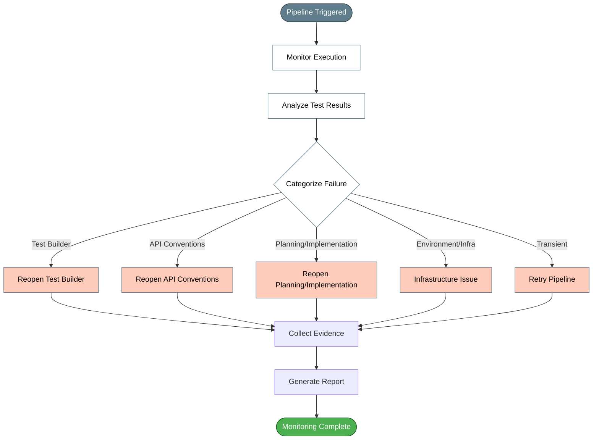

# CI Monitor (post-push monitoring, without dangerous auto-fix)

## When to Use

**Post-closer phase** (optional). After push to `feature/<story-id>-<context>`, the **pipeline opens PR and runs CI** (build + tests). This skill **monitors** that result, **categorizes** the failure and says **which phase to reopen** — closing the cycle that currently ends at closer.

## Principle

Reference agents did **self-healing automatic** with hardcoded credentials and automatic fixes. Here **not**:
- **No hardcoded credentials** — uses PR/CI tools the **agent already has** (agent can read PR status/logs directly). Those without access consult pipeline run via platform.
- **Categorization is suggestion**, not automatic fix. Who reopens phase respects **agent policy**: some agents suggest and review, don't implement code changes alone.
- **No dangerous loop**.

## Inputs
- The PR/branch `feature/` that pipeline opened (or repo + PR number).
- The story's `run-log.md` (in story folder in target service).

## Output
1. **Run Log Update** section (parsed by engine to append to `run-log.md`). Use `## Run Log Update` heading with CI status, failure category, phase to reopen, and evidence (job/log line).
2. Full CI report with status, categorized failures, and recommended actions.

## Failure Categorization (CI) → Phase to Reopen

| Category | Typical Signal | Probable Cause | Phase to Reopen (suggestion) |
|---|---|---|---|
| `GATEWAY_ROUTE_MISSING` | `403`/`404` where expected `200` on new route | route/contract not published in gateway | API conventions → review contract |
| `BACKEND_ERROR` | `500` where expected `2xx/422` | backend error | Planning/implementation (who has permission) |
| `SCHEMA_MISMATCH` | status OK but body different | tests outdated vs contract | Test builder → regenerate case |
| `TIMEOUT` | connection timeout | instability/infra | re-run job (no code change) |
| `AUTH_TLS` | `401/403` everywhere, or PKIX/SSL error | cert/STS/secrets | Certificate management + check secret manager |
| `STAGING_GATE` | functional failed in staging | staging gate working (without `\\|\\| true`) | fix before promoting |

## Procedure

1. Locate PR/CI of `feature/` (agent's PR tools).
2. Wait for CI to complete; if failed, download logs and test results.
3. **Categorize** first failure by table above (read test message).
4. Write in `run-log` the **category + phase to reopen + evidence** (job/line).
5. **Don't fix code alone** if policy doesn't allow — register "suggest reopening <phase>" and stop.
6. `TIMEOUT` → suggest **re-run** of job (no code change).

## Guardrails

- **Suggestion, not auto-fix**; respect **agent policy**.
- **No hardcoded credentials**; no automatic loop.
- Read **functional test** results, not unit test results.
- Don't confuse **staging gate failure** (expected when functional breaks) with infra error.

- **Respond in English.** All output must be in English.
## Next Step

Reopen indicated phase (test builder, API conventions, planning/implementation) per category.

## Phase Diagram

*See also: [workflow-phases.mmd](../workflow-phases.mmd) for complete workflow overview*

## Installation

Install according to your organization's AI assistant CLI and deployment processes.

