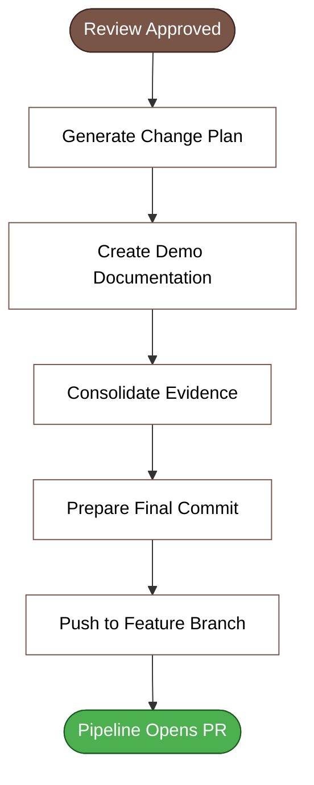

# Closer (Finalization & Push)

## When to Use

**Final phase** of the workflow. Invoke after code review has approved. Consolidates closing artifacts, registers evidence, and prepares the work item for merge.

## Principle

A work item is **ready for production** when it has complete evidence (tests, review, documentation) and a change plan that reduces risk. The closer **does not invent** what to do — it **documents** what was already done and validated in previous phases.

## Inputs

- **All previous artifacts** in the work item folder:
  - Specification document
  - Implementation plan
  - Task breakdown
  - Run log (all phases)
  - Implemented code
  - Functional tests
  - Code review results
- **Feature branch** with committed changes
- **Test results** (unit + functional)

## Output

1. **Run Log Update** section at the end of output (parsed by engine to append to `run-log.md`). Use `## Run Log Update` heading with phase summary, timestamps, and generated artifacts.

2. Two new artifacts in the work item folder:

### 1. Change Plan
Technical consolidation for PR/merge/deploy, containing:
- Change summary and scope
- Modified files (table)
- Dependencies and prerequisites (secrets, infrastructure, env vars)
- Deployment strategy (dev → staging → prod, order, smoke test, rollback)
- Pre-merge validation (checklist: tests, build, review, no credentials, logs/monitors)
- Risks and mitigation (table)
- Communication plan

### 2. Demo Documentation
Technical evidence of delivery (documentation per work item), containing:
- What was delivered (business value in 2-3 sentences)
- How to demonstrate (technical steps: endpoint/payload/expected result)
- Evidence (links: functional tests, unit tests, PR, dashboards)
- Acceptance criteria met (table: criterion → evidence)
- Points of attention (risks, technical debt, follow-ups)
- Next steps (operational deployment, monitoring)

## Procedure

1. **Validate preconditions** (gates):
   - Code review phase marked as `ok` in run log
   - Feature branch exists and has commits
   - Unit tests passing
   - Functional tests executed
   - No hardcoded credentials (validated in code review)

2. **Generate change plan**:
   - Fill based on previous artifacts:
     - Modified files: `git diff --name-status <base-branch>...HEAD`
     - Dependencies: from implementation plan (secrets, infrastructure, libs)
     - Deployment strategy: from implementation plan (order, smoke test)
     - Validations: check run log (all phases `ok`)
     - Risks: from implementation plan + specification (constraints/out-of-scope)

3. **Generate demo documentation**:
   - Fill based on previous artifacts:
     - What was delivered: specification objective in business language
     - How to demonstrate: technical steps from implementation plan (endpoints/payloads/result)
     - Evidence:
       - Functional tests: link to test results or pipeline
       - Unit tests: build/test results or coverage
       - Branch/PR: feature branch (PR opened by pipeline after push)
       - Dashboards: monitoring links (if observability in implementation plan)
     - Acceptance criteria met: table mapping each criterion from specification → evidence (test case)
     - Points of attention: technical debt, items marked in run log, follow-ups
     - Next steps: operational deployment (dev → staging → prod via pipeline), post-deployment monitoring

4. **Final commit**:
   - Include the 2 new artifacts: change plan and demo documentation
   - Suggested commit message:
     ```
     docs: add change plan and demo for work item <id>
     
     - Change plan with deployment strategy and risks
     - Demo documentation with technical evidence and acceptance criteria met
     
     Co-Authored-By: Devin <158243242+devin-ai-integration[bot]@users.noreply.github.com>
     ```

5. **Mark phase as `ok` in run log**:
   - Timestamp, summary: "Change plan and demo generated"
   - Artifacts: change plan, demo documentation

6. **Push to feature branch**:
   - `git push origin feature/<id>-<context>`
   - Pipeline detects push and **opens PR automatically** (feature → develop/main)
   - Inform user: "PR will be opened automatically by pipeline in a few minutes"

7. **Chain next phase (optional)**: pipeline monitoring (optional):
   - If team wants to monitor PR/CI automatically, suggest: "Want me to monitor the PR and pipeline? I can use pipeline monitoring skill"

## After completing phase

1. **Update run log** with timestamp + generated artifacts
2. **Inform user**:
   - Branch: feature branch with push done
   - PR: will be opened by pipeline (wait a few minutes)
   - Artifacts: change plan and demo documentation available in work item folder
   - Next steps: wait for PR approval → deploy dev → staging → prod

## Guardrails

- **Do not** push if any previous phase `failed` in run log — fix first.
- **Do not** push if there are hardcoded credentials (code review validation).
- **Do not** invent evidence — if a test didn't run, register "pending" in demo documentation.
- **Do not** do manual merge — PR is opened by pipeline; merge is team/product owner responsibility.
- Execution uses **current user identity** (commits) — never skill author's identity.

- **Respond in English.** All output must be in English.
## Installation

Install according to your organization's AI assistant CLI and deployment processes.

## Phase Diagram



*See also: [workflow-phases.mmd](../workflow-phases.mmd) for complete workflow overview*

## Optional Next Phase

Pipeline monitoring — monitors PR/CI that pipeline opened.
