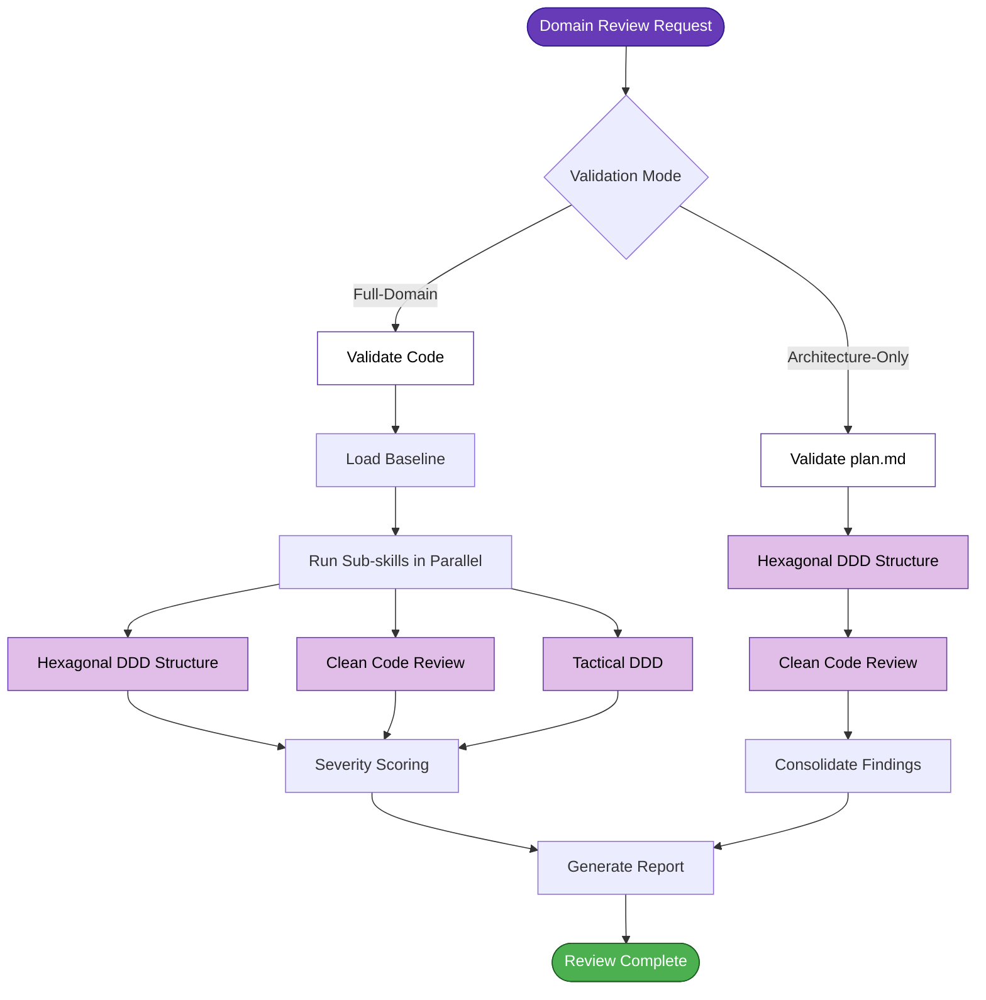

# Domain Review — Architecture & Domain Validation

Meta-skill that orchestrates **architecture + domain + quality** validations without running security/build/test validations (use code-reviewer for complete review).

## Initial Setup (first time in target service)

After installing this skill, configure validation:

### Option 1: Interactive command (recommended)

```bash
/domain-review --setup
```

This will ask:
- Team profile? (standard / custom)
- Default mode? (incremental / strict / advisory)
- Language/framework? (Java+Spring / C# / Go / Node)

And automatically generate:
- Validation configuration file
- Architecture profile
- Validation baseline (empty initially)

### Option 2: Copy templates manually

Templates are in skill assets, copy to target service and adjust per team.

## When to Use

| Phase | Scenario | Command |
|-------|----------|---------|
| **Planning** | Validate if plan follows patterns | `/domain-review --target plan.md --mode architecture-only` |
| **Implementation** | Quick feedback during dev (pre-commit) | `/domain-review src/` |
| **Code review** | Called automatically by code-reviewer | (internal) |

## Workflow

### Mode: `architecture-only` (validates plan.md)

```
1. Parse plan.md
   ├── Proposed structure (layers, packages)
   ├── Naming (Controller/UseCase/Port/etc.)
   └── Error handling strategy

2. Run hexagonal-ddd-structure --target plan.md
   └── Validates if plan follows hexagonal DDD + profile

3. Run clean-code-review --target plan.md
   └── Validates if decisions follow SOLID

4. Consolidate findings → report
```

### Mode: `full-domain` (validates implemented code)

```
1. Determine mode (strict / incremental / advisory)

2. Load baseline (if incremental)

3. Run sub-skills in parallel:
   ├── hexagonal-ddd-structure --mode <mode>
   │   └── Structure + Naming + Error Handling
   ├── clean-code-review --mode <mode>
   │   └── SOLID + Code Smells
   └── tactical-ddd --mode <mode> (if domain models detected)
       └── Anemia detection (optional)

4. Consolidate findings by severity:
   ├── 🔴 Critical (block merge)
   ├── 🟡 Moderate (fix recommended)
   └── 🟢 Minor (suggestions)

5. Report
```

## Orchestrated Sub-skills

### 1. hexagonal-ddd-structure
- **Input:** code paths or plan.md
- **Output:** structure + naming + error handling findings
- **Severity:** 0-10+ (Critical if >= 10)

### 2. clean-code-review
- **Input:** code paths
- **Output:** SOLID + code smells findings
- **Severity:** 0-10+ (Critical if >= 10)

### 3. tactical-ddd (conditional)
- **Input:** domain model paths
- **Output:** anemia detection + refactoring suggestions
- **Severity:** None/Mild/Moderate/Severe
- **Skip if:** no domain models detected

## Severity Scoring (consolidated)

```
Total Score = hexagonal_score + solid_score + anemia_score
```

| Score | Severity | Action |
|-------|----------|--------|
| 0-3 | ✅ OK | Approve |
| 4-6 | ⚠️ Moderate | Fix recommended |
| 7-9 | 🟠 High | Fix before merge |
| 10+ | 🔴 Critical | Block merge |

## Incremental Mode (default)

When `--mode incremental`:

1. **Detect modified files** (git diff)
2. **Load baseline**
3. **Run sub-skills** only on modified/new files
4. **Filter findings:**
   - 🔴 **BLOCK:** violations in **new code**
   - ⚠️  **REPORT:** violations in baseline (doesn't block)
   - 📊 **INVENTORY:** violations in unmodified code

## Strict Mode

When `--mode strict`:

1. **Validate EVERYTHING** (new + legacy code)
2. **Ignore baseline** (validates everything equally)
3. **Block** if total score >= 7

## Technical Debt Baseline

### Structure: validation-baseline.yml

```yaml
baseline_version: "1.0"
generated_at: "2026-07-10T14:25:00Z"
profile: "standard"

technical_debt:
  hexagonal_violations: [...]
  clean_code_violations: [...]
  anemia_violations: [...]

exclusions:
  paths:
    - "src/.../legacy/**"
  patterns:
    - "**/*Dto.java"

statistics:
  total_violations: 25
  by_severity:
    critical: 8
    moderate: 12
    minor: 5
```

## Commands

### Validate new code (default)
```bash
/domain-review src/
# Mode: incremental (validates only git diff)
```

### Validate plan (Planning phase)
```bash
/domain-review --target plan.md --mode architecture-only
```

### Complete refactor (rigorous mode)
```bash
/domain-review --mode strict src/
```

### Audit (doesn't block)
```bash
/domain-review --mode advisory src/
```

## Phase Diagram



*See also: [workflow-phases.mmd](../workflow-phases.mmd) for complete workflow overview*

## Guardrails

- **Respond in English.** All output must be in English.

## Installation

Install according to your organization's AI assistant CLI and deployment processes.