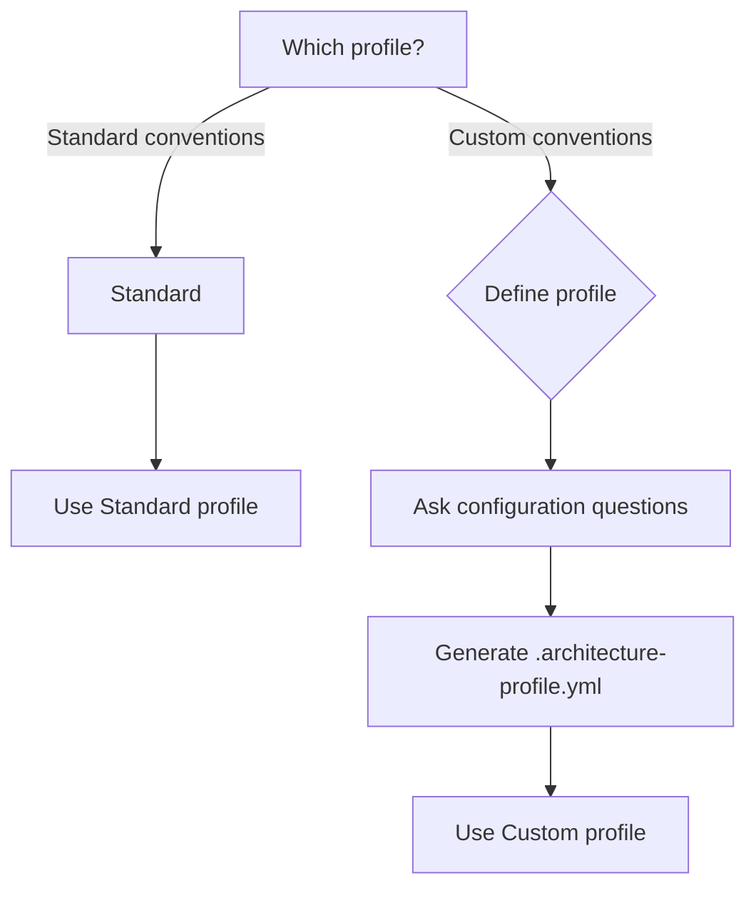

# Reference — Complete Architecture Profiles

This document contains **complete configurations** for each supported profile. Use as reference when validating or generating scaffolds.

---

## Profile: Standard

### Metadata

```yaml
profile_name: "Standard"
description: "Standard hexagonal DDD architecture"
language: "agnostic"
framework: "agnostic"
```

### Configuration

```yaml
pattern: "hexagonal-ddd"
language: "agnostic"
framework: "agnostic"

structure:
  base_package: "com.example.app"
  core_naming: "core"  # or "domain"
  adapters_naming: "plural"  # adapters/ not adapter/
  versioning_strategy: "none"  # no v1/ in new service
  core_framework_free: true
  
layers:
  core:
    - "core/model/"           # Entities, VOs, Aggregates
    - "core/ports/in/"        # Use case interfaces
    - "core/ports/out/"       # Repository/Integration interfaces
    - "core/usecase/"         # Use case implementations
    - "core/exception/"       # Domain exceptions
  
  adapters:
    in:
      - "adapters/in/http/controller/"
      - "adapters/in/http/dto/"
      - "adapters/in/http/response/"
      - "adapters/in/http/mapper/"
      - "adapters/in/http/filter/"
      - "adapters/in/http/handler/"  # Exception handlers
    out:
      - "adapters/out/database/"     # ORM entities, repos, mappers
      - "adapters/out/http/"         # HTTP clients
    commons:
      - "adapters/commons/config/"   # Configuration
      - "adapters/commons/util/"     # Utilities

naming:
  controller_suffix: "Controller"
  controller_versioned_suffix: "V{N}Controller"  # only if multiple versions
  usecase_port_suffix: "UseCasePort"
  repository_port_suffix: "RepositoryPort"
  integration_port_suffix: "IntegrationPort"
  client_suffix: "Client"
  mapper: "static_class_or_mapper_framework"
  response_wrapper: "ResponseDto<T>"
  main_class: "MainApplication"
  
error_handling:
  pattern: "rfc7807"  # or custom
  expose_internal_exceptions: false  # NEVER expose internal messages
  status_mapping:
    validation: 422
    business_logic: 422
    persistence: 500
    generic: 500
  
observability:
  correlation_header: "X-Correlation-ID"
  logging_framework: "agnostic"
```

---

## Profile: Custom

When a team has their own conventions, ask:

### Setup Questions

```
1. Base package? (e.g., com.company.app)
2. Core naming? (core/ or domain/)
3. Adapters naming? (adapters/ or adapter/ or infrastructure/)
4. Versioning strategy?
   [1] None (no v1/)
   [2] Path-based (v1/, v2/)
   [3] Header-based (Accept: application/vnd.api.v1+json)
5. Controller suffix? (Controller, Resource, Handler, ...)
6. Use Case port suffix? (UseCasePort, UseCase, Input, ...)
7. Repository port suffix? (RepositoryPort, Gateway, Output, ...)
8. Response wrapper?
   [1] None (direct JSON)
   [2] Data wrapper ({ "data": ... })
   [3] Custom (specify structure)
9. Error handling pattern?
   [1] RFC 7807 Problem Details
   [2] Custom enum-based
   [3] Other (specify)
10. Observability: correlation header name?
```

Generate `.architecture-profile.yml` with the answers.

---

## Scaffold Templates (by profile)

### Standard Template

```
<artifactId>/
├── src/main/java/com/example/app/
│   ├── adapters/
│   │   ├── commons/
│   │   │   ├── config/
│   │   │   │   └── Config.java
│   │   │   └── util/
│   │   │       └── Constants.java
│   │   ├── in/http/
│   │   │   ├── controller/
│   │   │   │   └── <Noun>Controller.java
│   │   │   ├── dto/
│   │   │   │   └── <Noun>RequestDto.java
│   │   │   ├── response/
│   │   │   │   └── ResponseDto.java
│   │   │   ├── mapper/
│   │   │   │   └── <Noun>Mapper.java
│   │   │   ├── filter/
│   │   │   │   └── CorrelationIdFilter.java
│   │   │   └── handler/
│   │   │       └── GlobalExceptionHandler.java
│   │   └── out/
│   │       ├── database/
│   │       │   ├── <Noun>Entity.java
│   │       │   ├── <Noun>Repository.java
│   │       │   ├── <Noun>RepositoryAdapter.java
│   │       │   └── <Noun>EntityMapper.java
│   │       └── http/
│   │           └── <System>Client.java
│   ├── core/
│   │   ├── exception/
│   │   │   ├── BusinessException.java
│   │   │   └── exceptions...
│   │   ├── model/
│   │   │   └── <Noun>.java
│   │   ├── ports/
│   │   │   ├── in/
│   │   │   │   └── <Verb><Noun>UseCasePort.java
│   │   │   └── out/
│   │   │       └── <Verb><Noun>RepositoryPort.java
│   │   └── usecase/
│   │       └── <Verb><Noun>UseCase.java
│   └── MainApplication.java
├── src/main/resources/
│   ├── application.yml
│   └── (other resources)
├── src/test/java/...
└── build file (pom.xml/build.gradle/...)
```

---

## Validation Rules Summary (all profiles)

| Rule | Severity | Universal or Profile-specific |
|------|----------|-------------------------------|
| Core depends on Adapters | 🔴 Critical (10) | Universal |
| Core with framework annotations | 🔴 Critical (8) | Universal |
| Ports are concrete classes | 🔴 Critical (8) | Universal |
| Wrong HTTP status | 🟡 Moderate (5) | Universal |
| Expose internal exceptions | 🔴 Critical (10) | Universal |
| Wrong package naming | 🟡 Moderate (4) | Profile-specific |
| v1/ in new service | 🟡 Moderate (4) | Profile-specific |
| No response wrapper | 🟡 Moderate (3) | Profile-specific |
| Generic naming | 🟡 Moderate (3) | Universal |

---

## Decision Tree (which profile to use?)



---

## Example: .architecture-profile.yml (Standard)

```yaml
# .architecture-profile.yml
# Standard profile for myservice

profile: "standard"
language: "agnostic"
framework: "agnostic"
base_package: "com.example.app"

structure:
  adapters_naming: "plural"
  versioning_strategy: "none"
  core_framework_free: true

naming:
  controller_suffix: "Controller"
  usecase_port_suffix: "UseCasePort"
  repository_port_suffix: "RepositoryPort"
  client_suffix: "Client"
  response_wrapper: "ResponseDto"

error_handling:
  pattern: "rfc7807"
  expose_internal_exceptions: false
  status_mapping:
    validation: 422
    persistence: 500

observability:
  correlation_header: "X-Correlation-ID"

generated_at: "2026-07-10T14:25:00Z"
last_validated: "2026-07-10T14:25:00Z"
```