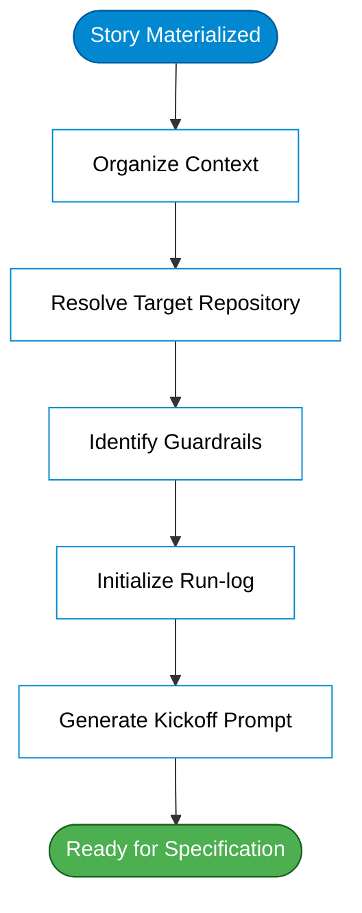

# Workflow Kickoff (Watcher / Kickoff)

## When to Use

As soon as a **new story** appears in the input directory (`.stories/<id>/` in target service). It's **phase 0**: prepares the ground for workflow to run — builds kickoff prompt and creates the `run-log`.

## Principle

The workflow is triggered by a **watcher** (an application/automation that "waits" for a new story). This skill is what the watcher activates first: it **doesn't** specify or plan — only **organizes context** and generates a clean, complete prompt for the specification phase.

## Inputs

- Story folder with raw story (`story.md`/ticket/link). Convention: in target service repo, artifacts go in **`.stories/<id>/`** (don't pollute root).
- **Base guardrails**: constitution (embedded in this skill) + (if exists) service configuration overrides.

## Output

1. `.stories/<id>/run-log.md` created from template (all phases `pending`, including empty cost section — filled per phase/total by cost tracking skill) in target service.
2. **Seed do run-log** section (parsed by engine to initialize `run-log.md`). Use `## Seed do run-log` as the heading, then list key metadata — workflow id, phase statuses, estimated cost, and timestamp.
3. **Kickoff prompt** (in `.stories/<id>/kickoff-prompt.md`) containing:
   - Story summary and code/identifier.
   - Target repository(ies), stack (Java/Python/IaC/doc) and environment(s).
   - Applicable guardrails (constitution summary + service overrides).
   - Instruction to start specification phase.
4. **Base context files** — this skill loads configuration files:
   - Agent guide — complete workflow guide (overview, structure, conventions)
   - Constitution — base guardrails (security, quality, DDD)
   
   These files are **copied to target service root** if they don't exist:
   - If service doesn't have these files → copy defaults
   - If service already has → **respect** (don't overwrite)
   - What's in target service **wins** (service customization)

## How Agent Finds Target Repository(ies)

Agent **doesn't guess** repository. Resolution is, in order:

1. **Explicit in story** (pattern): story's target section brings `repo:` (URL), `stack:`, `environments:` and `base-branch:`. Primary source.
2. **Catalog** (optional): if repo is cited by **name** and service catalog exists in repo, resolve name → URL by it.
3. **Ask**: if no explicit repo nor in catalog, **ask user** — never guess.

With resolved URL(s), agent does `clone`/`pull` of repo(s) and creates branch `feature/<story-id>-<context>` from `base-branch`.

## Procedure

1. **Locate story** in input folder; read raw content.
2. **Resolve target repository(ies)** (explicit → catalog → ask) and clone/pull; create `feature/` branch.
3. **Copy base context files** (if don't exist in target service):
   - Copy agent guide → service root (if not exist)
   - Copy constitution → service root (if not exist)
   - If already exist, **respect** (don't overwrite) — service may have customizations
4. **Load guardrails**: read agent guide and constitution from target service (now guaranteed)
5. **Identify stack**: predominant language, environment(s), available secrets (by name).
6. **Initialize `run-log`** with all phases `pending` (from template).
7. **Build kickoff prompt** (structured) referencing story, target repo, and guardrails.
8. **Mark phase 0 as `ok` in run-log and **chain** specification phase.

## Guardrails

- **Don't** invent requirements or decide implementation — only organize context.
- **Don't** guess target repository — resolve from story/catalog or **ask**.
- **Don't** leak secrets in prompt — reference by name (`${VAR}` / secret name).
- Execution uses **current user identity** (branch/commits) — never skill author's identity.
- Respect **service's agent guide** when it exists (wins over default).

- **Respond in English.** All output must be in English.
## Phase Diagram

*See also: [workflow-phases.mmd](../workflow-phases.mmd) for complete workflow overview*

## Next Step

Specification phase — generate the specification document.

## Installation

Install according to your organization's AI assistant CLI and deployment processes.

