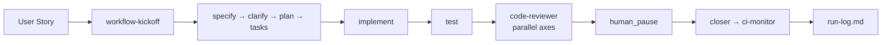

<div align="center">

# aiwf

**AI Workflow Engine CLI** — skill-driven, agent-assisted software delivery.

Turn a user story into a complete, auditable trail of engineering artifacts —
from kickoff to code review to CI — without losing human control.

[](https://github.com/DeysiLopes/aiwf/actions/workflows/ci-main.yml)
[](https://github.com/DeysiLopes/aiwf/actions/workflows/ci-develop.yml)


</div>

---

## Highlights

- **Full delivery pipeline out of the box** — 13 skills chained into one flow: kickoff → setup → specification → clarification → planning → tasks → implementation → tests → code review → closure → CI monitoring.
- **Human in the loop** — a `human_pause` step forces a human checkpoint before finalization; the AI never "closes the story" alone.
- **Resume anywhere** — state is persisted after every step, so you can pause and pick up where you left off.
- **Parallel reviews** — the code-reviewer phase runs two independent axes (technical standards + spec fidelity) as concurrent sub-agents.
- **Test without spending tokens** — `--dry-run` renders every prompt without calling a model.
- **Provider-agnostic** — plug in Opencode Zen (default) or OpenAI.
- **TDD-aware** — reorders `test` before `implement` when the workflow declares it.
- **Auto run-log** — every step appends to a consolidated run log for full traceability.
- **Ubiquitous context** — a `CONTEXT.md` is injected into every prompt automatically.

## How it works



Each phase is a **skill** (a `SKILL.md` prompt template) declared in a `workflow.yaml`.
The engine renders the skill with the accumulated artifacts, calls the LLM,
stores the result, and moves on.

## Quick start

```bash
npm install
npm run build
npm link

aiwf init                          # scaffold .agents/ (skills, workflows, artifacts)
aiwf create STORY-123 --title "My story" --acceptance "when X then Y"
aiwf run STORY-123                 # run the whole pipeline
aiwf resume STORY-123              # continue after a human_pause
```

> No idea what to write yet? Ship a sample workflow into your repo with
> `aiwf init` and run `aiwf run EXAMPLE-001`.

## Commands

| Command | Description |
|---|---|
| `aiwf init` | Copies built-in skills, a sample workflow, and creates `.agents/` in the target repo |
| `aiwf create <id>` | Generates a `workflow.yaml` for a story using the LLM |
| `aiwf run <id>` | Executes the workflow end to end (or to the first pause) |
| `aiwf resume <id>` | Resumes from the last completed step |
| `--dry-run` | Simulates execution without calling a model |
| `--manual` | Renders prompts and waits for external artifacts (agent mode) |
| `--model / --provider` | Selects the LLM model and provider |

## AI provider setup

**Opencode Zen (default)** — key lives in `~/.config/opencode/.env`:

```env
OPENCODE_API_KEY=sk-...
```

```bash
aiwf run STORY-123                          # default model
aiwf run STORY-123 --provider zen --model big-pickle
```

**OpenAI**:

```bash
export OPENAI_API_KEY=your_token
aiwf run STORY-123 --provider openai --model gpt-4o-mini
```

## Anatomy of a workflow

```yaml
id: STORY-001
name: "Authentication module"
artifacts_dir: ./artifacts/STORY-001
tdd: false

steps:
  - id: workflow-kickoff
    skill: skills/workflow-kickoff/SKILL.md
    input:
      story_title: "Authentication module"
      story_description: "{{workflow.description}}"
    output:
      artifact: prompt-inicial.md
    on_existing: skip

  - id: implement
    skill: skills/implement/SKILL.md
    input:
      tasks: "{{artifacts.tasks}}"
    output:
      artifact: implementation.md
    on_existing: overwrite

  - id: review
    type: human_pause
    prompt: "Review the artifacts, then run: aiwf resume STORY-001"

  - id: closer
    skill: skills/closer/SKILL.md
    output:
      artifact: closure.md
```

Artifacts from earlier steps are available to later skills via `{{artifacts.<step-id>}}`
(and `{{workflow.description}}` for the story text).

## What you get

```text
artifacts/STORY-123/
├── prompt-inicial.md      # kickoff prompt
├── specification.md       # technical spec + acceptance criteria
├── clarification.md       # assumptions & open questions
├── plan.md                # implementation plan
├── tasks.md               # atomic task breakdown
├── implementation.md      # implementation guide
├── teste.md               # test strategy
├── review.md              # parallel code review verdict
├── closure.md             # change plan
└── run-log.md             # auditable trail of every step
```

## Skill catalog

**Core pipeline (in order):** `workflow-kickoff` · `verify-install` · `git-flow` ·
`specify` · `clarify` · `context` · `plan` · `tasks` · `implement` · `test` ·
`code-reviewer` · `closer` · `ci-monitor`

**On demand:** `brainstorming` · `domain-review` · `clean-code-review` ·
`java-architecture` · `hexagonal-ddd-structure` · `api-conventions` ·
`observability-patterns` · `exception-handling` · `engineering-best-practices` ·
`chaos-validation` · `database-proxy` · `cloud-solution-architect` · `research` ·
`prototype` · `grilling` · `wayfinder` · `wizard` · `teach` · `handoff` · `writing-for-agents`

## Project structure

```text
src/          core machinery (engine, state, artifacts, skills, templates, LLM)
skills/       agnostic SKILL.md templates
examples/     sample workflows (STORY-001, STORY-002, STORY-DAISIES-DB)
workflows/    built-in example used by `init`
tests/        engine-level unit tests
```

## Development

```bash
npm run typecheck   # tsc --noEmit
npm test            # vitest
npm run build       # tsc build
```

## License

ISC — built by **Deysi Lopes**.