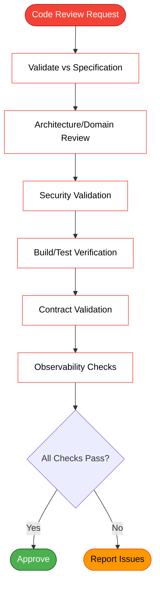

# Code Reviewer

## When to Use

**Review phase** of the workflow. After implementation (especially code, done by a developer or by an AI agent with permissions), reviews the diff against specification, plan, and checklist.

## Two axes of review

Run **two independent reviews in parallel** (fan out as parallel sub-agents; then consolidate):

1. **Axis 1 — Standards / smell quality**: engineering principles (SOLID, code smells, domain language, error handling, security, hygiene). Run the cross-cutting review skills in parallel: `clean-code-review`, `engineering-best-practices`, `domain-review`, `java-architecture`, `api-conventions`, `observability-patterns`, `exception-handling`. Point smells as **suggestions**; block only if they violate team standards.
2. **Axis 2 — Spec fidelity**: does the implementation satisfy the specification/plan/acceptance criteria? Does it use the **`context` domain vocabulary** (`CONTEXT.md`)? Gate on **adherence**, not taste: acceptance criteria implemented and covered by test, contracts honored, plan followed.

Consolidate both axes into a single verdict — a "clean" Axis 1 does NOT approve if Axis 2 shows missing acceptance criteria, and vice-versa.

## Inputs

- PR/branch to review (diff).
- Specification, implementation plan, and the **review checklist** generated in planning phase.
- `context`: Domain model (`{{context}}`) to verify vocabulary adherence.

## Output
1. **Run Log Update** section (parsed by engine to append to `run-log.md`). Use `## Run Log Update` heading with review verdict (approved/rejected), issues found, and timestamp.
2. Review comments (inline + summary) and a **filled checklist** (✔/✖ per item) with objective recommendations.

## Base checklist (complement with story-specific)

### Adherence
- [ ] Each acceptance criterion from specification is implemented and covered by test.
- [ ] Follows implementation plan (architecture, contracts, data model).

### Quality / patterns
- [ ] **General best practices**: SOLID (SRP/DIP), no obvious code smells (Long Method/Large Class/Long Parameter List/Primitive Obsession/Feature Envy), domain naming, early return. Point as suggestion; block only if violates team standards.
- [ ] DDD/layers respected (adapters in/out, use cases, domain); **clean core** (no framework annotations in domain).
- [ ] **Domain naming**, not generic — ex.: `OrderItemsValidator` (domain), **not** `RequiredFieldsValidator`.
- [ ] **No `v1/`** in path for new service (only services with multiple API versions coexisting).
- [ ] **Error handling in team pattern**: global exception handler + error codes + i18n; **never** expose `ex.getMessage()`; business validation → **422**; catch-all (`Exception.class`) last. Reject if replaced with loose models.
- [ ] Correct status codes (400/404/409/422/5xx).
- [ ] Module versions come from **BOM** (not hardcoded in build file); use standard libraries; reuse existing modules instead of reimplementing.
- [ ] Conditional validations (required fields by type/flow).
- [ ] **Contract matches API rules**: schema base on singular of path, wrapper, named/realistic examples in POST/PUT/PATCH/DELETE, `camelCase`.

### Build & hygiene (blocking)
- [ ] **Green build/tests** against **entire module** (not just touched file). Refactor of enum/contract updated **all usages** (mapper/validator/tests) — no constants/methods removed still referenced.
- [ ] **Evidence attached** (verification gate): each "ready/green" has **command + output/exit code** (or CI job link) in run log. No evidence = reject (don't accept "trusted it compiles").
- [ ] **No tool/installation artifacts** in diff: tool directories, `node_modules/`, build artifacts — and `.gitignore` covers them.

### Security (blocking)
- [ ] **No hardcoded credentials** (client_id/secret/apikey/token).
- [ ] **No `.env*`** in diff; `.gitignore` covers `.env*`.
- [ ] No PII/secrets in logs.

### Observability
- [ ] correlationId/MDC propagated; metrics/alarms when planned.
- [ ] **No custom business metrics** without approval; use MDC/tagging + native metrics; monitoring as code (JSON per environment).

### Tests
- [ ] Unit tests covering new rules (**including error/edge cases**, not just happy path) — **TDD** approach recommended: test first, then rule.
- [ ] **Local integration test** ran **before push** (local run + curl/swagger, or build verify) — with **evidence** (command + output/exit code) attached in run log. Don't rely only on pipeline.
- [ ] Functional tests covering positives and negatives; dry run OK.

### Git / pipeline
- [ ] Branch `feature/<id>-<context>`; **no manual PR to main**.
- [ ] Fail-on-error: dev `false`, staging `true`.

## Procedure

1. **Read specification/plan/checklist** and the diff. Load the `context` domain model (`CONTEXT.md`) — check whether the implementation advances or violates the shared vocabulary (terms, naming, concepts). If it violates, flag under "Spec fidelity".

2. **Validate architecture/domain (delegate to domain review)**:
   ```
   Detect validation mode:
   ? [1] Incremental (default) — validates only new code
   ? [2] Strict — complete refactor (validates everything)
   ? [3] Advisory — audit (doesn't block)
   
   Call: /domain-review --mode <chosen>
   ```
   - **If mode=incremental**: blocks only for issues in NEW code
   - **If mode=strict**: blocks for any violation (new + legacy)
   - **If mode=advisory**: reports everything, blocks nothing
   
   Domain review executes automatically:
   - Hexagonal DDD validator (structure, naming, error handling)
   - Clean code review (SOLID, code smells)
   - Tactical DDD (anemia - if domain models exist)

3. **Validate security** (blocking):
   - No hardcoded credentials
   - No committed .env*
   - No PII in logs

4. **Validate build/tests** (blocking):
   - Green build (mandatory evidence)
   - Passing tests (mandatory evidence)
   - No tool artifacts in diff

5. **Validate contracts/observability** (if applicable):
   - API conventions (if REST API)
   - Observability patterns (if metrics/MDC)

6. **Consolidate findings** from BOTH axes (standards + spec) and all validations:
   - Structure output in two sections: **Eixo 1 — Standards/smells** and **Eixo 2 — Spec fidelity**, then a synthesis verdict.
   - Prioritize by severity (critical → high → moderate → minor)
   - Mark ✔/✖ in checklist with evidence (file:line)
   - Block if EITHER axis has blocking items.

7. **Deliver** summary + filled checklist + prioritized recommendations.

## After completing phase

1. **Mark phase as `ok` in run log** with timestamp and review summary.
2. **Chain next phase**: Closer (commit + change plan + demo documentation; push to feature branch).

## Guardrails

- Reviewer **does not** rewrite implementation — points and recommends; implementer adjusts (AI agent, in particular, doesn't edit code: only reviews).
- Don't approve with open security item.

- **Respond in English.** All output must be in English.
## Installation

Install according to your organization's AI assistant CLI and deployment processes.

## Optional Skills

These are **optional** and used **on demand**. If review needs one and it's **not installed**, follow your organization's installation process and **register in run log** (artifact + reason).

| Artifact (type) | When |
|---|---|
| **Domain review** (meta-skill) | **orchestrate** architecture/domain/quality validation (calls 3 sub-skills) |
| **Hexagonal DDD validator** (skill) | validate hexagonal structure, DDD naming, error handling |
| **Clean code review** (skill) | validate SOLID, code smells, refactorings |
| Tactical DDD (skill) | detect domain anemia, rich domain patterns |
| API conventions (skill) | review contract vs API rules |
| Observability patterns (skill) | review MDC/metrics/monitors (team restrictions) |

## Phase Diagram



*See also: [workflow-phases.mmd](../workflow-phases.mmd) for complete workflow overview*

## Next Phase

Closer: commit + change plan + demo documentation; push to feature branch (pipeline opens PR).

